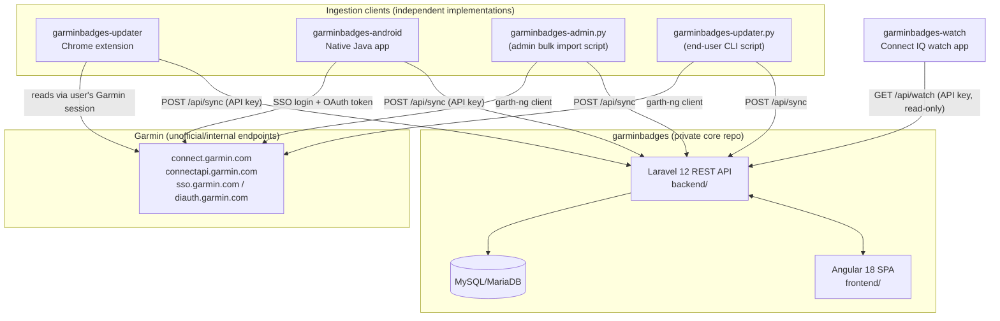

# Architecture

## System diagram

## The sync flow

None of the four ingestion clients trust each other or share code at runtime — each is a standalone reimplementation of "log into Garmin, read badge/challenge data, upload it." This is intentional: it means the core backend has exactly one ingestion contract (`POST /api/sync`) to maintain, and clients can be swapped, ported to new platforms, or fixed independently when Garmin changes something upstream.

1. **Authenticate to Garmin.** Each client gets access to Garmin's internal APIs a different way:
   - The **Chrome extension** rides on the user's already-authenticated `connect.garmin.com` browser tab/session — it doesn't handle credentials itself.
   - The **Android app** performs a full native Garmin SSO login (including MFA) and exchanges it for an OAuth2 token via `diauth.garmin.com`.
   - The **Python scripts** (bundled inside the core repo, one for admin bulk-import and one distributed to end users) use the third-party `garth-ng` library to authenticate.
2. **Read badge/challenge data.** All clients hit the same family of Garmin internal endpoints under `connectapi.garmin.com` — `badge-service` (earned/available badges, badge detail) and `badgechallenge-service` (active/virtual challenges).
3. **Normalize and upload.** Each client shapes what it finds into a `user_badges` array and `POST`s it to `https://api.garminbadges.com/api/sync`, authenticated with a **GarminBadges API key** (issued per-user by the site, not a Garmin credential) as a bearer token. Most also call `GET /api/sync/whoami` and `GET /api/badges` to reconcile IDs against the site's badge catalogue before uploading.
4. **Display.** The Angular SPA and the watch app both read back from the same backend — the SPA through the general API, the watch through a purpose-built `GET /api/watch` endpoint that pre-shapes upcoming badges and at-risk challenges for a small screen.

## API surface (as used by the ecosystem)

| Endpoint | Used by | Purpose |
|---|---|---|
| `POST /api/sync` | Extension, Android app, both Python scripts | Upload a user's earned/in-progress badge data |
| `GET /api/sync/whoami` | Extension, Android app | Confirm the API key maps to the expected user |
| `GET /api/badges` | Extension, Android app | Fetch the site's badge catalogue for ID reconciliation |
| `GET /api/watch` | Watch app | Read-only, pre-shaped payload: upcoming badges, challenges ending soon, in-progress challenges |
| `POST /api/auth/google/callback` | SPA | Google OAuth login (Laravel Socialite) |
| `POST /api/support/webhook` | Stripe | Signature-verified subscription/donation webhook |

## Core data model (summary)

The core backend's schema centers on:

- **`User`** — account, `api_key` (used by all sync clients), `garmin_username`, supporter/subscription state, notification and privacy preferences.
- **`Badge`** and lookup tables (`BadgeCategory`, `BadgeType`, `BadgeDifficulty`, `BadgeUnit`, `BadgeSeries`, `BadgeAssocType`) — the badge catalogue.
- **`UserBadge`** — join table between users and badges: earned/in-progress state, `earned_number`, `progress_value`, dates. This is what every sync client writes to via `/api/sync`.
- **`Country`** — badge country restrictions.
- **`SocialAccount`** — linked OAuth identities.
- Social/community tables: `follows`, `user_hidden_users`, `BlogPost`/`BlogComment`, `UserReport` (moderation).
- **`AiKnowledgeEntry`** — knowledge base backing a supporter-only AI assistant feature.

## Deployment model

There is no containerized deployment — the core app builds as plain artifacts (a Laravel `backend.zip` and a static Angular `frontend.zip`) via GitHub Actions on every push to `main` or version tag, then ships to a traditional Apache + PHP-FPM server via an rsync-based deploy script. A cron-driven Laravel scheduler (`schedule:run`) handles periodic jobs (translation checks, supporter-expiry).

The core repo's CI also reaches out to the `garminbadges-updater` repo's GitHub Releases to fetch the latest built extension `.zip` and bundle it into the Angular frontend's `/tools/` download page — the one point of build-time coupling between two of these otherwise-independent repos.

## External integrations (core backend only)

- **Stripe** — supporter subscriptions/donations, checkout + billing portal + webhook.
- **Anthropic API** — powers a supporter-only AI badge assistant.
- **Google OAuth** (Socialite) — social login.
- **Mailjet** — transactional email.
- **Google Analytics 4** — frontend analytics.

None of these are used by the ingestion clients (extension, Android app, watch app, Python scripts) — they only ever talk to Garmin's endpoints and the GarminBadges `/api/sync` / `/api/watch` surface.
